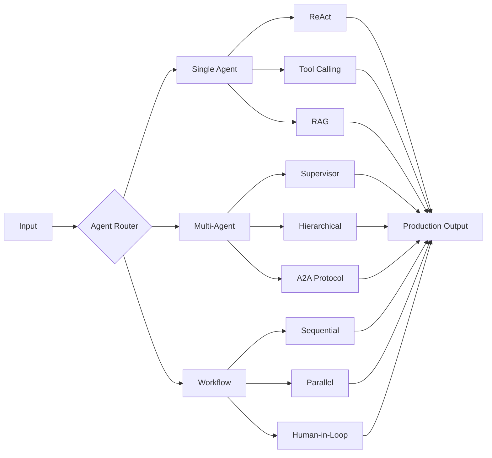

<div align="center">

<!-- Animated Typing Header -->
<a href="https://git.io/typing-svg"></a>

<br/>

<!-- Social Badges -->
<a href="https://linkedin.com/in/subashn"></a>&nbsp;
<a href="mailto:subash.var01@gmail.com"></a>&nbsp;
<a href="https://github.com/suboss87"></a>

<br/><br/>


</div>

<br/>

## About Me

I architect intelligent AI systems that automate complex enterprise workflows. My focus is on **multi-agent orchestration**, **workflow automation**, and building AI solutions that actually work in production &mdash; not just demos.

```yaml
name: Subash Natarajan
role: Agentic AI Architect
location: Building the future of AI Agents
currently_building: AutoOps - Production AI platform with security, RAG, and auto-RCA
interests:
  - Multi-Agent Systems & A2A Protocol
  - MCP (Model Context Protocol) & Function Calling
  - LLM Cost Optimization & Production ML
  - Enterprise Workflow Automation
philosophy: "If it's not in production, it's just a prototype."
```

<br/>

## Tech Stack

<div align="center">

### Languages & Frameworks
<a href="https://skillicons.dev"></a>

### Cloud & Infrastructure
<a href="https://skillicons.dev"></a>

### Data & Observability
<a href="https://skillicons.dev"></a>

</div>

<br/>

## AI & Agent Frameworks

<div align="center">
<table>
<tr>
<td align="center" width="140">
<br/>
<sub><b>Complex Flows</b></sub>
</td>
<td align="center" width="140">
<br/>
<sub><b>Google Cloud</b></sub>
</td>
<td align="center" width="140">
<br/>
<sub><b>Quick Start</b></sub>
</td>
<td align="center" width="140">
<br/>
<sub><b>Azure / .NET</b></sub>
</td>
<td align="center" width="140">
<br/>
<sub><b>Team Roles</b></sub>
</td>
</tr>
</table>
</div>

<br/>

## Agent Architecture Expertise

<div align="center">



</div>

<br/>

## Featured Projects

<div align="center">
<table>
<tr>

<td width="50%" valign="top">
<h3 align="center">Invoice&sup3; &mdash; AI Invoice Processing</h3>
<p align="center">
<a href="https://github.com/suboss87/Invoice3_Staging">

</a>
</p>
<p>
Production-grade AI invoice processor with <b>LandingAI ADE</b> for 45+ field extraction, <b>LangGraph</b> multi-agent validation (3-way matching + fraud detection), and <b>Langfuse</b> observability. Full-stack: FastAPI + React + TypeScript.
</p>
<p>


</p>
</td>

<td width="50%" valign="top">
<h3 align="center">AutoOps &mdash; Production AI Platform</h3>
<p align="center">

</p>
<p>
Enterprise AI ops platform with <b>auto-RCA</b>, <b>security scanning</b>, <b>RAG pipelines</b>, and intelligent alerting. Designed for production workloads with multi-agent orchestration, A2A protocol support, and cost-optimized LLM routing.
</p>
<p>


</p>
</td>

</tr>
</table>
</div>

<br/>

## GitHub Analytics

<div align="center">


<br/><br/>


<br/><br/>


</div>

<br/>

## Contribution Snake

<div align="center">

<picture>
  <source media="(prefers-color-scheme: dark)" srcset="https://raw.githubusercontent.com/suboss87/suboss87/output/github-snake-dark.svg" />
  <source media="(prefers-color-scheme: light)" srcset="https://raw.githubusercontent.com/suboss87/suboss87/output/github-snake.svg" />
  
</picture>

</div>

<br/>

---

<div align="center">


<br/>

**"If it's not in production, it's just a prototype."**

</div>
