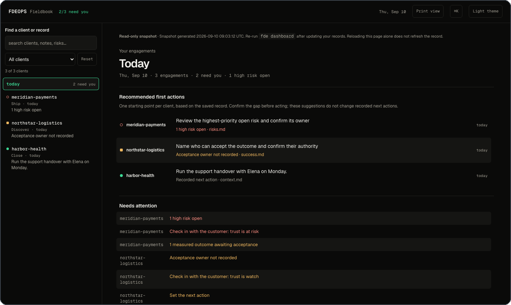

### I help enterprises take AI from a business problem through architecture into production.

Field CTO at [Siel AI](https://www.linkedin.com/in/subashn/) and a cloud and AI enterprise architect. Over 15 years my work has moved from software and automation into cloud platforms, enterprise architecture and now AI, at Ericsson, NTT DATA, VMware and Fujitsu across APAC. At Fujitsu I led the regional Cloud Centre of Excellence and grew it to 28 architects in six markets ([career history](https://www.linkedin.com/in/subashn/details/experience/)).

### Selected engagements

| Problem | What I changed | Result |
|:---|:---|:---|
| Invoice approval for a manufacturer, 6,500 invoices a month | OCR and vision-language extraction, with deterministic validation before approval | 18 → 3 minutes per invoice, $7.58 → $2.34 per invoice, field accuracy 65% → 98% |
| E-commerce support pilot projected at $36,000 a month | Replaced six agents with a deterministic orchestrator, one conversational agent and caching, plus escalation rules and evaluation | 97% fewer model calls per conversation |
| 34-bot RPA estate in a regulated environment | Rebuilt it on a local LLM-backed automation layer | Maintenance 55 → 14 hours a month, human-review exceptions 40% → 18% |
| Internal policy and contract search | Redesigned retrieval and access controls | Lookup 25 → under 3 minutes, architecture reused in two later builds |

Client work at Siel AI since May 2024. Clients are not named.

### Open source

#### [FDEOps](https://github.com/suboss87/FDEOps)
948 stars · 104 forks · [30 releases](https://github.com/suboss87/FDEOps/releases) · about 5,800 [npm downloads](https://www.npmjs.com/package/fdeops) last month

FDEOps packages the working method of a forward deployed engineer as skills for AI coding agents. Its 35 task skills cover discovery, scoping, building, verification and handover, and a local record keeps each customer's decisions between sessions. It [installs into](https://github.com/suboss87/FDEOps/blob/Main/docs/install.md) Claude Code, Cursor, Codex and Copilot.

The fieldbook, a read-only view of local customer records. Run <code>npx fdeops demo</code> to generate it from sample notes.

#### [SeedCamp](https://github.com/suboss87/SeedCamp2.0)
Python · FastAPI · Docker · [CI on every push](https://github.com/suboss87/SeedCamp2.0/actions/workflows/ci.yml) · MIT

SeedCamp is a reference architecture for generating AI video in batches. It routes each job to a premium or cheaper model, retries failures, checks prompts before spending money and records the cost of every video. The README states its limit, a few hundred videos per run, and documents how to go past it.

#### [CodeQuorum](https://github.com/suboss87/CodeQuorum)
Python · LangGraph · GitHub Action · [27 tests](https://github.com/suboss87/CodeQuorum/actions/workflows/tests.yml) · MIT

CodeQuorum runs three reviewer agents with different priorities on each pull request. A problem is marked "fix it" only when at least two of them find it independently, so confidence comes from agreement rather than a model grading itself ([example review](https://github.com/suboss87/CodeQuorum#example-pr-comment)).

### Upstream

[Six merged fixes in OpenClaw](https://github.com/openclaw/openclaw/pulls?q=is%3Apr+author%3Asuboss87+is%3Amerged): Slack reconnects, Telegram approvals, Ollama model IDs, OpenAI reasoning blocks and hook context.

### Writing

- [Multi-Cloud Handbook for Developers](https://www.packtpub.com/en-us/product/multi-cloud-handbook-for-developers-9781804617090) (Packt), a book on designing and running cloud-native applications across AWS, Azure and GCP, co-written with Jeveen Jacob.
- [Agentic AI Architecture Framework for Enterprises](https://www.infoq.com/articles/agentic-ai-architecture-framework/) on InfoQ, co-written with Ahilan Ponnusamy.
- [Articles on The New Stack](https://thenewstack.io/author/subash-natarajan/) about multicloud strategy and FinOps.
- [FDE field notes](https://fdeops.substack.com/), a newsletter on forward deployed engineering.

### Contact

[subash.io](https://subash.io) · [LinkedIn](https://www.linkedin.com/in/subashn/) · [suboss87@gmail.com](mailto:suboss87@gmail.com)
