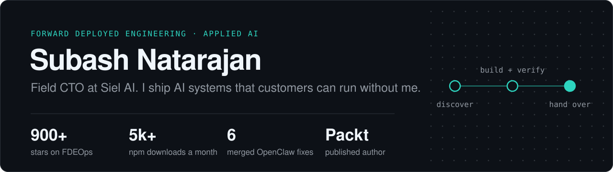

I work as a forward deployed engineer at [Siel AI](https://www.linkedin.com/in/subashn/). My work starts after the demo: sitting with a customer's team, finding the problem worth solving, and shipping an AI system they can run without me. I write about [what that looks like in the field](https://fdeops.substack.com/p/what-forward-deployed-engineering).

Before Siel I spent 15 years at Ericsson, NTT DATA, Fujitsu and VMware on cloud platforms and large system integrations ([career history](https://www.linkedin.com/in/subashn/details/experience/)).

**What I've built**

- **[FDEOps](https://github.com/suboss87/FDEOps)** gives an AI coding agent the working method of a forward deployed engineer. It has 35 task skills for discovery, scoping, building, verification and handover, plus a local record that keeps customer decisions between sessions. It [installs into](https://github.com/suboss87/FDEOps/blob/Main/docs/install.md) Claude Code, Cursor, Codex and Copilot. 948 stars, 104 forks, [30 releases](https://github.com/suboss87/FDEOps/releases) and about 5,800 [npm downloads](https://www.npmjs.com/package/fdeops) last month.
- **[SeedCamp](https://github.com/suboss87/SeedCamp2.0)** is a reference architecture for generating AI video in batches. It routes each job to a premium or cheaper model, retries failures, checks prompts before spending money and records the cost of every video. The README states its limit, a few hundred videos per run, and documents how to go past it.
- **[CodeQuorum](https://github.com/suboss87/CodeQuorum)** runs three reviewer agents with different priorities on each pull request. A problem is marked "fix it" only when at least two of them find it on their own, so confidence comes from agreement rather than a model grading itself ([example review](https://github.com/suboss87/CodeQuorum#example-pr-comment)).

**Upstream**

- [Six merged fixes in OpenClaw](https://github.com/openclaw/openclaw/pulls?q=is%3Apr+author%3Asuboss87+is%3Amerged): Slack reconnects, Telegram approvals, Ollama model IDs, OpenAI reasoning blocks and hook context.

**Writing**

- [Multi-Cloud Handbook for Developers](https://www.packtpub.com/en-us/product/multi-cloud-handbook-for-developers-9781804617090) (Packt), co-written with Jeveen Jacob.
- [Agentic AI Architecture Framework for Enterprises](https://www.infoq.com/articles/agentic-ai-architecture-framework/) (InfoQ), co-written with Ahilan Ponnusamy.
- [FDE field notes](https://fdeops.substack.com/), a newsletter about forward deployed engineering.
- [Articles on The New Stack](https://thenewstack.io/author/subash-natarajan/) about multicloud strategy and FinOps.

**Get in touch:** [subash.io](https://subash.io) · [LinkedIn](https://www.linkedin.com/in/subashn/) · [email](mailto:suboss87@gmail.com)
